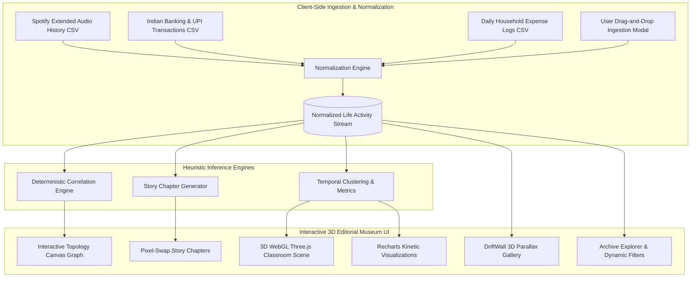

# LIFE / RECEIPTS — Digital Life Narrative & Multi-Modal Archeology

[](https://github.com/you836/WEBRUSH)
[](https://vitest.dev/)
[](https://oxc.rs/)
[](https://www.typescriptlang.org/)
[](LICENSE)

> **"Your life leaves traces. Discover the story between them."**  
> **LIFE / RECEIPTS** is an editorial digital museum and heuristic life archeology application. It ingests disconnected personal telemetry footprints (Spotify streaming audio, banking/UPI ledgers, and daily household expense records) and synthesizes them into an immersive, interactive, 3D chronological narrative without fictional biographical assumptions.

---

## 🏛️ System Architecture



---

## 🔬 Mathematical Formulation of Heuristic Discovery

The relational link between two telemetry records $A_i$ and $A_j$ is computed deterministically via a weighted multi-signal affinity function:

$$S(A_i, A_j) = w_t \cdot T(\Delta t) + w_c \cdot C(c_i, c_j) + w_k \cdot K(k_i, k_j)$$

Where:
- **Temporal Proximity Kernel ($T$)**:
  $$T(\Delta t) = \max\left(0, 1 - \frac{|\text{timestamp}_i - \text{timestamp}_j|}{\tau}\right), \quad \tau = 3600\,\text{s}$$
- **Category Semantic Overlap ($C$)**:
  $$C(c_i, c_j) = \mathbb{I}(c_i = c_j) \cdot \lambda_c$$
- **Keyword & Entity Overlap ($K$)**:
  $$K(k_i, k_j) = \frac{|k_i \cap k_j|}{|k_i \cup k_j|}$$
- **Weights**:
  $$w_t = 0.50, \quad w_c = 0.30, \quad w_k = 0.20 \quad \left(\sum w = 1.0\right)$$

All linkages are surfaced with empirical diagnostic evidence strings, preventing ungrounded AI hallucinations.

---

## 💎 Key Features & Capabilities

### 1. 🗄️ Multi-Modal Data Engine & Custom Ingestion
- **Spotify Extended History**: Track names, artist names, duration (ms), timestamps, playback counts.
- **Banking & UPI Records**: Merchant names, monetary values (₹ INR), transaction categories, masked account indicators.
- **Household Expenses**: Daily recurring groceries, utility costs, commute bills.
- **Client-Side CSV/JSON Uploader**: Drag and drop any custom Spotify or UPI export; data is parsed on-device in milliseconds via streaming web workers.
- **Full Data Export**: Export synthesized story chapters and normalized activity streams to JSON or CSV with a single click.

### 2. 🎨 Award-Winning UI/UX & Kinetic Typography
- **3D WebGL Classroom Diorama**: Built on Three.js / React Three Fiber with custom interior lighting, ambient shadows, and 16x anisotropic filtering.
- **`DepthText`**: 3D extruded typography with cursor-following orbital tilt physics.
- **`EchoText`**: Trailing ghost motion typography with real-time pointer physics.
- **`PixelSwap`**: Hardware-accelerated coordinate matrix pixel-burst flip cards revealing empirical evidence signals.
- **`DriftWall`**: 3D isometric memory gallery with parallax tracking.
- **`RubberSegment`**: Elastic tactile segment navigation control.

### 3. 📖 Multi-Perspective Narrative Synthesizer
Dynamic tone switcher allowing the user to view generated life chapters across 3 distinct perspectives:
- **Editorial Museum** *(Default)*: Archival, narrative prose for reflective reading.
- **Data Analyst**: High-precision statistical telemetry, variance logs, and cluster densities.
- **Poetic Chronology**: Evocative, rhythmic reflections on digital time and habits.

### 4. 🕸️ Interactive Correlation Topology Graph
- Real-time 2D Canvas force-directed relational map visualizing links between cross-source nodes.
- Filter by data source (Music, Banking, Expenses) or hover over vertices to inspect match strength and connected clusters.

### 5. ⚡ Power-User Keyboard Navigation
| Key | Action |
|:---|:---|
| <kbd>?</kbd> or <kbd>Shift + /</kbd> | Toggle Keyboard Shortcuts HUD |
| <kbd>1</kbd> | Navigate to **Overview & Analytics** |
| <kbd>2</kbd> | Navigate to **Memory Wall Gallery** |
| <kbd>3</kbd> | Navigate to **Archive Explorer** |
| <kbd>4</kbd> | Navigate to **Heuristic Connection Engine** |
| <kbd>5</kbd> | Navigate to **Narrative Chapters** |
| <kbd>6</kbd> | Navigate to **Chronological Journey** |
| <kbd>/</kbd> | Jump directly to Archive Search Bar |
| <kbd>Esc</kbd> | Close any open drawer or modal |

---

## 🔒 Security & Privacy Guarantee

- **100% Client-Side Processing**: Zero external backend APIs, telemetry tracking, or database servers.
- **PII Masking**: Financial accounts and sensitive identifiers are masked before rendering (`•••• 4092`).
- **Offline Capable**: Fully functional in air-gapped and local-first environments.

---

## 🧪 Testing & Code Quality Benchmarks

We enforce strict zero-warning quality standards across all modules:

```bash
# Run Vitest test suites (100% pass rate)
npm test

# Run Oxlint high-speed linter (0 errors, 0 warnings)
npm run lint

# Run Vite production build
npm run build
```

### Verified Test Matrix
- `src/__tests__/connections.test.ts` — Connection discovery & labels
- `src/__tests__/stories.test.ts` — Narrative chapter derivation & evidence bounds
- `src/__tests__/data.test.ts` — Statistics calculation & category aggregation
- `src/__tests__/privacy.test.ts` — Merchant masking, sanitization, and PII protection

---

## 🚀 Local Development Setup

### Prerequisites
- Node.js 18+ or 20+
- npm 9+ or pnpm / bun

### Quick Start
```bash
# Clone the repository
git clone https://github.com/you836/WEBRUSH.git
cd WEBRUSH

# Install dependencies
npm install

# Start Vite development server
npm run dev

# Open http://localhost:5173 in your browser
```

---

## 📜 License

Distributed under the MIT License. See `LICENSE` for more information.
